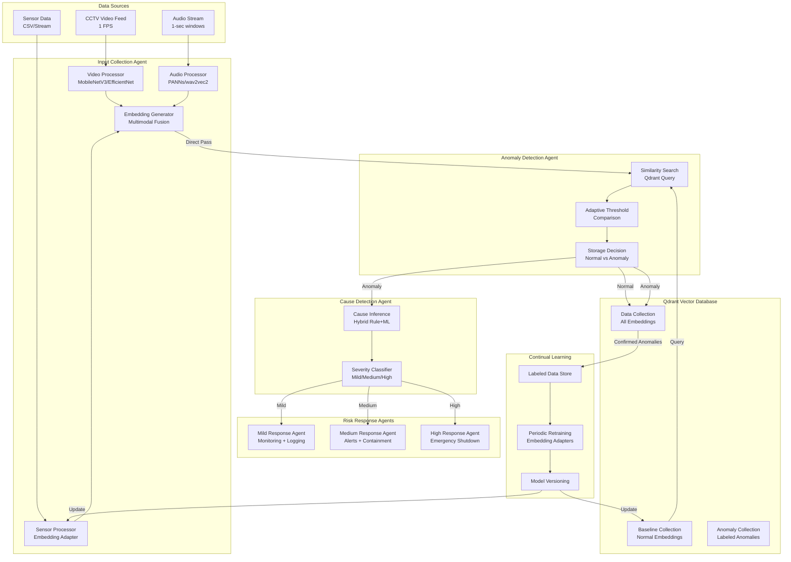

# Design Document: Chemical Leak Monitoring System

## Overview

The Chemical Leak Monitoring System is a production-grade, multi-agent architecture designed to detect and respond to chemical leaks in industrial facilities through real-time analysis of multimodal data streams. The system processes video (1 FPS), audio (1-second windows), and sensor data (1-second intervals) to identify anomalies, determine root causes, classify severity, and trigger appropriate emergency responses.

### Architecture Philosophy

The system follows a microservices-based multi-agent architecture where each agent has a specific responsibility:

1. **Input Collection Agent**: Ingests raw multimodal data, generates learned embeddings, and passes them to the anomaly detection pipeline
2. **Anomaly Detection Agent**: Receives embeddings, performs similarity search against baselines, applies adaptive thresholds, and stores results in Qdrant
3. **Cause Detection Agent**: Analyzes flagged anomalies to identify root causes and classify severity
4. **Risk Response Agents (3)**: Execute severity-appropriate emergency protocols with MSDS/SOP integration

### Key Design Decisions

**Embedding-First Approach**: Rather than storing raw data, the system converts all modalities into learned vector embeddings. This enables:

- Efficient similarity-based anomaly detection
- Unified representation across heterogeneous data types
- Scalable storage and retrieval through vector databases

**Direct Agent Communication**: Embeddings flow directly from Input Collection Agent to Anomaly Detection Agent rather than being stored first. This reduces latency and allows the Anomaly Detection Agent to make intelligent storage decisions based on anomaly status.

**Adaptive Thresholds**: The system uses dynamically adjusted thresholds based on false positive/negative rates rather than static values, enabling the system to adapt to changing operational conditions.

**Late Fusion Strategy**: Embeddings for each modality are generated independently and stored as separate vectors in Qdrant's multivector schema. This allows:

- Per-modality anomaly scoring
- Graceful degradation when modalities fail
- Modality-specific distance metrics
- Easier debugging and interpretability

## Architecture

### System Architecture Diagram



### Agent Communication Flow

1. **Input Collection → Anomaly Detection**: Direct in-memory pass of embedding objects (no serialization)
2. **Anomaly Detection → Cause Detection**: Message queue or direct call with anomaly metadata
3. **Cause Detection → Risk Response**: Severity-based routing to appropriate response agent
4. **All Agents → Qdrant**: Async database operations for storage and retrieval

### Concurrency Model

- **Async I/O**: All agents use Python asyncio for non-blocking operations
- **Parallel Processing**: Video, audio, and sensor embeddings generated concurrently
- **Queue-Based Buffering**: When downstream agents are busy, embeddings are queued
- **Backpressure Handling**: Input collection slows down if queue depth exceeds threshold

## Components and Interfaces

### 1. Input Collection Agent

**Responsibilities**:

- Ingest video frames, audio windows, and sensor readings
- Generate learned embeddings for each modality
- Pass embeddings to Anomaly Detection Agent

**Key Components**:

#### Video Processor

```python
class VideoProcessor:
    def __init__(self, model_name: str = "mobilenet_v3_small"):
        # Use MobileNetV3-Small for lightweight, fast inference
        # Justification:
        # - Latency: ~15ms per frame on CPU
        # - Accuracy: 67.7% ImageNet top-1 (sufficient for industrial scenes)
        # - Size: 2.5M parameters (deployable on edge devices)
        # Alternative: EfficientNet-B0 (higher accuracy, 2x latency)

    async def process_frame(self, frame: np.ndarray) -> np.ndarray:
        # Preprocessing: resize to 224x224, normalize
        # Feature extraction: use penultimate layer (1024-dim)
        # Returns: video embedding vector
```

**Model Selection Justification**:

- **MobileNetV3-Small**: Chosen for real-time performance on CPU/edge devices. Trained on ImageNet, fine-tunable for industrial scenes (gas plumes, sparks, PPE detection).
- **Alternative Considered**: YOLO-based object detection - rejected due to higher latency and unnecessary bounding box overhead for embedding-based detection.

#### Audio Processor

```python
class AudioProcessor:
    def __init__(self, model_name: str = "panns_cnn14"):
        # Use PANNs CNN14 for acoustic event detection
        # Justification:
        # - Trained on AudioSet (527 classes including industrial sounds)
        # - Latency: ~50ms per 1-second window
        # - Embedding dim: 2048
        # Alternative: wav2vec2 (better for speech, worse for industrial sounds)

    async def process_audio(self, audio: np.ndarray, sr: int) -> np.ndarray:
        # Spectral preprocessing: mel-spectrogram (128 bins)
        # Feature extraction: CNN14 embeddings
        # Returns: audio embedding vector
```

**Model Selection Justification**:

- **PANNs CNN14**: Chosen for industrial acoustic event detection. Pre-trained on AudioSet which includes hissing, alarms, and mechanical sounds.
- **Spectral Preprocessing**: Mel-spectrogram captures frequency patterns relevant to gas leaks (hissing in 2-8kHz range) and alarms.

#### Sensor Processor

```python
class SensorEmbeddingAdapter(nn.Module):
    def __init__(self, input_dim: int = 5, hidden_dim: int = 64, embed_dim: int = 128):
        # Learned embedding adapter for sensor data
        # Architecture: Input(5) -> Dense(64, ReLU) -> Dense(128, tanh)
        # Justification:
        # - Learns non-linear relationships between sensor features
        # - Normalizes different scales (temp, pressure, ppm, vibration, flow)
        # - Compact representation (128-dim) for efficient similarity search

    def forward(self, sensor_data: torch.Tensor) -> torch.Tensor:
        # Input: [temperature, pressure, gas_concentration, vibration, flow_rate]
        # Normalization: z-score per feature
        # Returns: sensor embedding vector
```

**Normalization Strategy**:

```python
# Per-feature normalization parameters (computed from training data)
SENSOR_MEANS = {
    'temperature_celsius': 93.5,
    'pressure_bar': 18.0,
    'gas_concentration_ppm': 430.0,
    'vibration_mm_s': 11.5,
    'flow_rate_lpm': 75.0
}

SENSOR_STDS = {
    'temperature_celsius': 5.8,
    'pressure_bar': 2.5,
    'gas_concentration_ppm': 65.0,
    'vibration_mm_s': 3.2,
    'flow_rate_lpm': 15.0
}
```

#### Embedding Generator

```python
@dataclass
class MultimodalEmbedding:
    timestamp: datetime
    video_embedding: Optional[np.ndarray]  # 1024-dim
    audio_embedding: Optional[np.ndarray]  # 512-dim
    sensor_embedding: Optional[np.ndarray]  # 128-dim
    metadata: Dict[str, Any]  # location, camera_id, sensor_ids, plant_zone

class EmbeddingGenerator:
    async def generate(
        self,
        video_frame: Optional[np.ndarray],
        audio_window: Optional[np.ndarray],
        sensor_data: Optional[Dict[str, float]]
    ) -> MultimodalEmbedding:
        # Parallel processing of all modalities
        # Returns: MultimodalEmbedding object
```

### 2. Anomaly Detection Agent

**Responsibilities**:

- Receive embeddings from Input Collection Agent
- Query baseline collection for similarity search
- Apply adaptive thresholds
- Store embeddings in Qdrant with anomaly labels

**Key Components**:

#### Similarity Search Engine

```python
class SimilaritySearchEngine:
    def __init__(self, qdrant_client: QdrantClient):
        self.client = qdrant_client

    async def search_baselines(
        self,
        embedding: MultimodalEmbedding,
        top_k: int = 10
    ) -> Dict[str, List[ScoredPoint]]:
        # Per-modality similarity search
        # Returns: {modality: [scored_points]} with distance scores

    def compute_anomaly_scores(
        self,
        search_results: Dict[str, List[ScoredPoint]]
    ) -> Dict[str, float]:
        # Compute per-modality anomaly scores
        # Score = min_distance_to_baseline (lower distance = more normal)
        # Returns: {modality: anomaly_score}
```

**Distance Metrics by Modality**:

- **Video**: Cosine similarity (normalized embeddings, direction matters more than magnitude)
- **Audio**: Cosine similarity (spectral patterns are directional)
- **Sensor**: Euclidean distance (magnitude of deviation matters for physical measurements)

**Justification**: Cosine similarity for neural embeddings (captures semantic similarity), Euclidean for sensor embeddings (captures magnitude of physical deviation).

#### Adaptive Threshold Manager

```python
class AdaptiveThresholdManager:
    def __init__(self, initial_thresholds: Dict[str, float]):
        # Initial thresholds per modality (learned from validation data)
        # Example: {'video': 0.7, 'audio': 0.65, 'sensor': 2.5}
        self.thresholds = initial_thresholds
        self.false_positive_window = deque(maxlen=100)
        self.false_negative_window = deque(maxlen=100)

    def update_thresholds(self, feedback: AnomalyFeedback):
        # Adjust thresholds based on operator feedback
        # False positive → increase threshold (more lenient)
        # False negative → decrease threshold (more strict)
        # Update rule: threshold *= (1 + learning_rate * error_signal)

    def is_anomaly(self, scores: Dict[str, float]) -> Tuple[bool, float]:
        # Multi-modality voting: anomaly if ANY modality exceeds threshold
        # Confidence: weighted average of per-modality deviations
        # Returns: (is_anomaly, confidence_score)
```

**Adaptive Threshold Algorithm**:

```python
# Exponential moving average with feedback
def update_threshold(current_threshold, feedback_type, learning_rate=0.05):
    if feedback_type == "false_positive":
        # Increase threshold to reduce false positives
        return current_threshold * (1 + learning_rate)
    elif feedback_type == "false_negative":
        # Decrease threshold to catch more anomalies
        return current_threshold * (1 - learning_rate)
    return current_threshold
```

#### Storage Manager

```python
class StorageManager:
    async def store_embedding(
        self,
        embedding: MultimodalEmbedding,
        is_anomaly: bool,
        anomaly_scores: Dict[str, float]
    ):
        # Store in Qdrant data collection with labels
        # Payload includes: timestamp, metadata, is_anomaly, scores
        # If anomaly: also trigger Cause Detection Agent
```

### 3. Cause Detection Agent

**Responsibilities**:

- Analyze anomalies to identify root causes
- Classify severity (mild/medium/high)
- Provide explainable outputs

**Key Components**:

#### Cause Inference Engine

```python
@dataclass
class CauseAnalysis:
    primary_cause: str  # gas_plume, audio_anomaly, pressure_spike, etc.
    contributing_factors: List[str]
    confidence: float
    explanation: str
    similar_historical_incidents: List[str]  # IDs of similar past incidents

class CauseInferenceEngine:
    def __init__(self, qdrant_client: QdrantClient):
        # Similarity-based cause inference using labeled anomaly baselines
        self.client = qdrant_client
        self.cause_baselines = self._load_cause_baselines()

    async def infer_cause(
        self,
        embedding: MultimodalEmbedding,
        anomaly_scores: Dict[str, float],
        metadata: Dict[str, Any]
    ) -> CauseAnalysis:
        # Step 1: Query labeled_anomalies collection for similar incidents
        similar_incidents = await self._search_similar_incidents(embedding, top_k=10)

        # Step 2: Aggregate causes from similar incidents (weighted by similarity)
        cause_votes = self._aggregate_causes(similar_incidents)

        # Step 3: Select primary cause and contributing factors
        primary_cause = max(cause_votes, key=cause_votes.get)
        contributing_factors = [c for c, score in cause_votes.items()
                               if score > 0.3 and c != primary_cause]

        # Step 4: Generate explanation based on similarity patterns
        explanation = self._generate_explanation(
            primary_cause, similar_incidents, anomaly_scores, metadata
        )

        return CauseAnalysis(
            primary_cause=primary_cause,
            contributing_factors=contributing_factors,
            confidence=cause_votes[primary_cause],
            explanation=explanation,
            similar_historical_incidents=[inc.id for inc in similar_incidents[:3]]
        )

    async def _search_similar_incidents(
        self,
        embedding: MultimodalEmbedding,
        top_k: int
    ) -> List[ScoredPoint]:
        # Search labeled_anomalies collection for similar past incidents
        # Use multivector search across all available modalities
        results = await self.client.search(
            collection_name="labeled_anomalies",
            query_vector={
                "video": embedding.video_embedding,
                "audio": embedding.audio_embedding,
                "sensor": embedding.sensor_embedding
            },
            limit=top_k,
            with_payload=True
        )
        return results

    def _aggregate_causes(self, similar_incidents: List[ScoredPoint]) -> Dict[str, float]:
        # Weighted voting based on similarity scores
        cause_votes = {}
        total_score = sum(inc.score for inc in similar_incidents)

        for incident in similar_incidents:
            cause = incident.payload['ground_truth_cause']
            weight = incident.score / total_score
            cause_votes[cause] = cause_votes.get(cause, 0.0) + weight

        return cause_votes

    def _generate_explanation(
        self,
        primary_cause: str,
        similar_incidents: List[ScoredPoint],
        anomaly_scores: Dict[str, float],
        metadata: Dict[str, Any]
    ) -> str:
        # Generate human-readable explanation
        top_incident = similar_incidents[0]
        similarity_score = top_incident.score

        explanation = (
            f"Detected {primary_cause} with {similarity_score:.2%} similarity to "
            f"historical incident {top_incident.id}. "
            f"Anomaly scores: video={anomaly_scores.get('video', 0):.2f}, "
            f"audio={anomaly_scores.get('audio', 0):.2f}, "
            f"sensor={anomaly_scores.get('sensor', 0):.2f}. "
            f"Location: {metadata.get('plant_zone', 'unknown')}, "
            f"Shift: {metadata.get('shift', 'unknown')}."
        )

        return explanation
```

**Cause Baseline Strategy**:
The system maintains a collection of labeled anomalies with ground truth causes. When a new anomaly is detected:

1. Search for the K most similar historical incidents using multivector similarity
2. Aggregate causes from similar incidents using weighted voting
3. Select the cause with highest vote as primary cause
4. Provide explainability through reference to similar historical incidents

This approach:

- Learns from historical data rather than hardcoded rules
- Adapts as new labeled incidents are added
- Provides explainability through concrete examples
- Handles novel anomaly patterns through similarity matching

#### Severity Classifier

```python
class SeverityClassifier:
    def classify_severity(
        self,
        cause: CauseAnalysis,
        anomaly_scores: Dict[str, float],
        metadata: Dict[str, Any]
    ) -> str:
        # Severity classification logic
        # High: gas_concentration > 1000 ppm OR multiple modalities > threshold
        # Medium: gas_concentration 500-1000 ppm OR 2 modalities anomalous
        # Mild: gas_concentration < 500 ppm OR single modality anomalous

        severity_score = self._compute_severity_score(cause, anomaly_scores, metadata)

        if severity_score > 0.8:
            return "high"
        elif severity_score > 0.5:
            return "medium"
        else:
            return "mild"

    def _compute_severity_score(self, cause, scores, metadata) -> float:
        # Weighted combination of factors
        score = 0.0

        # Factor 1: Gas concentration (if available)
        if 'gas_concentration_ppm' in metadata:
            ppm = metadata['gas_concentration_ppm']
            score += min(ppm / 1000.0, 1.0) * 0.4

        # Factor 2: Number of anomalous modalities
        anomalous_count = sum(1 for s in scores.values() if s > threshold)
        score += (anomalous_count / len(scores)) * 0.3

        # Factor 3: Cause-specific severity
        if cause.primary_cause in ['gas_leak_with_hissing', 'valve_malfunction']:
            score += 0.3

        return min(score, 1.0)
```

### 4. Risk Response Agents

**Responsibilities**:

- Execute severity-appropriate emergency protocols
- Integrate MSDS and SOP information
- Log all actions

**Key Components**:

#### MSDS/SOP Integration

```python
@dataclass
class ChemicalInfo:
    name: str
    cas_number: str
    exposure_limits: Dict[str, float]  # TWA, STEL, IDLH
    emergency_procedures: List[str]
    ppe_requirements: List[str]

class MSDSIntegration:
    def __init__(self, msds_database_path: str):
        # Load MSDS database (JSON/SQLite)
        self.msds_db = self._load_msds_database(msds_database_path)

    def get_chemical_info(self, chemical_name: str) -> ChemicalInfo:
        # Retrieve MSDS information for detected chemical
        # Supports: Chlorine, Ammonia, MIC, acidic/toxic gases

class SOPIntegration:
    def __init__(self, sop_database_path: str):
        # Load SOP database organized by plant_zone and severity
        self.sop_db = self._load_sop_database(sop_database_path)

    def get_procedures(self, plant_zone: str, severity: str) -> List[str]:
        # Retrieve zone-specific SOPs for given severity level
```

#### Response Agents

```python
class ResponseStrategyEngine:
    def __init__(self, qdrant_client: QdrantClient):
        # Similarity-based response strategy selection
        self.client = qdrant_client
        self.response_baselines = self._load_response_baselines()

    async def get_response_strategy(
        self,
        cause: CauseAnalysis,
        severity: str,
        metadata: Dict[str, Any]
    ) -> Dict[str, Any]:
        # Query response_strategies collection for similar past incidents
        similar_responses = await self._search_similar_responses(
            cause, severity, metadata, top_k=5
        )

        # Aggregate successful response actions from similar incidents
        recommended_actions = self._aggregate_actions(similar_responses)

        # Get MSDS/SOP information
        msds_info = await self._get_msds_info(cause.primary_cause)
        sop_procedures = await self._get_sop_procedures(
            metadata.get('plant_zone'), severity
        )

        return {
            'actions': recommended_actions,
            'msds_info': msds_info,
            'sop_procedures': sop_procedures,
            'similar_incidents': [r.id for r in similar_responses[:3]],
            'confidence': similar_responses[0].score if similar_responses else 0.0
        }

    async def _search_similar_responses(
        self,
        cause: CauseAnalysis,
        severity: str,
        metadata: Dict[str, Any],
        top_k: int
    ) -> List[ScoredPoint]:
        # Search response_strategies collection
        # Filter by severity and plant_zone for relevant strategies
        results = await self.client.search(
            collection_name="response_strategies",
            query_filter={
                "must": [
                    {"key": "severity", "match": {"value": severity}},
                    {"key": "plant_zone", "match": {"value": metadata.get('plant_zone')}}
                ]
            },
            query_vector=cause.similar_historical_incidents[0],  # Use most similar incident
            limit=top_k,
            with_payload=True
        )
        return results

    def _aggregate_actions(self, similar_responses: List[ScoredPoint]) -> List[str]:
        # Aggregate actions from similar successful responses
        action_votes = {}

        for response in similar_responses:
            actions = response.payload.get('successful_actions', [])
            effectiveness = response.payload.get('effectiveness_score', 1.0)

            for action in actions:
                weight = response.score * effectiveness
                action_votes[action] = action_votes.get(action, 0.0) + weight

        # Return actions sorted by vote weight
        sorted_actions = sorted(action_votes.items(), key=lambda x: x[1], reverse=True)
        return [action for action, _ in sorted_actions]

class MildResponseAgent:
    def __init__(self, qdrant_client: QdrantClient):
        self.strategy_engine = ResponseStrategyEngine(qdrant_client)

    async def execute_response(
        self,
        cause: CauseAnalysis,
        metadata: Dict[str, Any]
    ):
        # Get similarity-based response strategy
        strategy = await self.strategy_engine.get_response_strategy(
            cause, severity="mild", metadata=metadata
        )

        # Execute recommended actions
        for action in strategy['actions']:
            await self._execute_action(action, metadata)

        # Log incident with strategy details
        await self._log_incident(cause, strategy, metadata)

class MediumResponseAgent:
    def __init__(self, qdrant_client: QdrantClient):
        self.strategy_engine = ResponseStrategyEngine(qdrant_client)

    async def execute_response(
        self,
        cause: CauseAnalysis,
        metadata: Dict[str, Any]
    ):
        # Get similarity-based response strategy
        strategy = await self.strategy_engine.get_response_strategy(
            cause, severity="medium", metadata=metadata
        )

        # Execute recommended actions with MSDS/SOP integration
        for action in strategy['actions']:
            await self._execute_action(action, metadata, strategy['msds_info'])

        # Log incident with strategy details
        await self._log_incident(cause, strategy, metadata)

class HighResponseAgent:
    def __init__(self, qdrant_client: QdrantClient):
        self.strategy_engine = ResponseStrategyEngine(qdrant_client)

    async def execute_response(
        self,
        cause: CauseAnalysis,
        metadata: Dict[str, Any]
    ):
        # Get similarity-based response strategy
        strategy = await self.strategy_engine.get_response_strategy(
            cause, severity="high", metadata=metadata
        )

        # Execute critical actions immediately
        await self._trigger_emergency_alarm(metadata['plant_zone'])

        # Execute recommended actions with MSDS/SOP integration
        for action in strategy['actions']:
            await self._execute_action(action, metadata, strategy['msds_info'])

        # Execute chemical-specific emergency procedures
        for procedure in strategy['sop_procedures']:
            await self._execute_procedure(procedure, metadata)

        # Log incident and notify authorities
        await self._log_incident(cause, strategy, metadata)
        await self._notify_authorities(cause, metadata)
```

**Response Baseline Strategy**:
The system maintains a collection of historical response strategies with effectiveness scores. When a new incident occurs:

1. Search for similar past incidents with the same severity and plant_zone
2. Aggregate successful actions from similar responses (weighted by similarity and effectiveness)
3. Integrate MSDS/SOP information for the specific cause and location
4. Execute recommended actions in priority order

This approach:

- Learns from past response effectiveness rather than fixed procedures
- Adapts strategies based on what worked in similar situations
- Provides explainability through reference to similar incidents
- Continuously improves as new response outcomes are recorded

## Data Models

### Qdrant Schema Design

#### Collection: `baselines`

```python
# Stores baseline embeddings for normal operating conditions
collection_config = {
    "vectors": {
        "video": {
            "size": 512,
            "distance": "Cosine"
        },
        "audio": {
            "size": 512,
            "distance": "Cosine"
        },
        "sensor": {
            "size": 128,
            "distance": "Euclid"
        }
    },
    "payload_schema": {
        "timestamp": "datetime",
        "shift": "keyword",  # morning, afternoon, night
        "equipment_id": "keyword",
        "plant_zone": "keyword",
        "baseline_type": "keyword"  # shift_baseline, equipment_baseline, global_baseline
    }
}
```

**Indexing Strategy**:

- HNSW index for each vector (M=16, ef_construct=100)
- Payload index on: shift, equipment_id, plant_zone
- Enables fast filtered similarity search (e.g., "find similar baselines for night shift in Zone A")

#### Collection: `data`

```python
# Stores all embeddings (normal and anomalous)
collection_config = {
    "vectors": {
        "video": {"size": 1024, "distance": "Cosine"},
        "audio": {"size": 2048, "distance": "Cosine"},
        "sensor": {"size": 128, "distance": "Euclid"}
    },
    "payload_schema": {
        "timestamp": "datetime",
        "location": "geo",  # lat/lon for spatial queries
        "camera_id": "keyword",
        "sensor_ids": "keyword[]",
        "plant_zone": "keyword",
        "shift": "keyword",
        "is_anomaly": "bool",
        "anomaly_scores": {
            "video": "float",
            "audio": "float",
            "sensor": "float"
        },
        "cause": "keyword",  # if anomaly
        "severity": "keyword",  # if anomaly: mild/medium/high
        "operator_feedback": "keyword"  # confirmed/false_positive/false_negative
    }
}
```

**Indexing Strategy**:

- HNSW index for vectors
- Payload index on: timestamp, plant_zone, is_anomaly, severity
- Range index on: timestamp (for time-window queries)
- Enables queries like: "Find all high-severity anomalies in Zone B from last 24 hours"

#### Collection: `labeled_anomalies`

```python
# Stores confirmed anomalies for continual learning
collection_config = {
    "vectors": {
        "video": {"size": 1024, "distance": "Cosine"},
        "audio": {"size": 2048, "distance": "Cosine"},
        "sensor": {"size": 128, "distance": "Euclid"}
    },
    "payload_schema": {
        "timestamp": "datetime",
        "ground_truth_cause": "keyword",
        "ground_truth_severity": "keyword",
        "chemical_detected": "keyword",
        "operator_notes": "text",
        "training_weight": "float"  # importance for retraining
    }
}
```

#### Collection: `response_strategies`

```python
# Stores historical response strategies with effectiveness scores
collection_config = {
    "vectors": {
        "incident_embedding": {"size": 128, "distance": "Cosine"}  # Embedding of incident characteristics
    },
    "payload_schema": {
        "timestamp": "datetime",
        "incident_id": "keyword",  # Reference to labeled_anomalies
        "cause": "keyword",
        "severity": "keyword",  # mild/medium/high
        "plant_zone": "keyword",
        "successful_actions": "keyword[]",  # List of actions that were effective
        "failed_actions": "keyword[]",  # List of actions that were ineffective
        "effectiveness_score": "float",  # 0.0-1.0, based on outcome assessment
        "response_time_seconds": "float",
        "outcome": "keyword",  # contained/escalated/resolved
        "operator_assessment": "text"
    }
}
```

**Indexing Strategy**:

- HNSW index for incident_embedding vector
- Payload index on: severity, plant_zone, cause, effectiveness_score
- Enables queries like: "Find most effective responses for high-severity gas leaks in Zone A"

### Pydantic Data Models

```python
from pydantic import BaseModel, Field, validator
from typing import Optional, Dict, List
from datetime import datetime
import numpy as np

class SensorReading(BaseModel):
    timestamp_sec: int
    temperature_celsius: float = Field(ge=0, le=200)
    pressure_bar: float = Field(ge=0, le=50)
    gas_concentration_ppm: float = Field(ge=0, le=10000)
    vibration_mm_s: float = Field(ge=0, le=100)
    flow_rate_lpm: float = Field(ge=0, le=500)

    @validator('gas_concentration_ppm')
    def validate_gas_concentration(cls, v):
        if v > 5000:
            # Warning level for most industrial gases
            pass
        return v

class MultimodalEmbedding(BaseModel):
    timestamp: datetime
    video_embedding: Optional[List[float]] = Field(None, min_items=1024, max_items=1024)
    audio_embedding: Optional[List[float]] = Field(None, min_items=2048, max_items=2048)
    sensor_embedding: Optional[List[float]] = Field(None, min_items=128, max_items=128)
    metadata: Dict[str, Any]

    class Config:
        arbitrary_types_allowed = True

class AnomalyDetection(BaseModel):
    embedding: MultimodalEmbedding
    is_anomaly: bool
    anomaly_scores: Dict[str, float]
    confidence: float = Field(ge=0.0, le=1.0)
    timestamp: datetime

class CauseAnalysis(BaseModel):
    primary_cause: str
    contributing_factors: List[str]
    confidence: float = Field(ge=0.0, le=1.0)
    explanation: str
    severity: str = Field(pattern="^(mild|medium|high)$")

class EmergencyResponse(BaseModel):
    severity: str
    actions_taken: List[str]
    msds_reference: Optional[str]
    sop_reference: Optional[str]
    timestamp: datetime
    plant_zone: str
```

### Configuration Models

```python
class SystemConfig(BaseModel):
    # Qdrant configuration
    qdrant_host: str = Field(default="localhost")
    qdrant_port: int = Field(default=6333)
    qdrant_api_key: Optional[str] = None

    # Model paths
    video_model_path: str
    audio_model_path: str
    sensor_model_path: str

    # Threshold configuration
    initial_thresholds: Dict[str, float] = {
        "video": 0.7,
        "audio": 0.65,
        "sensor": 2.5
    }
    threshold_learning_rate: float = 0.05

    # Performance configuration
    processing_timeout_ms: int = 1000
    queue_max_depth: int = 100

    # MSDS/SOP paths
    msds_database_path: str
    sop_database_path: str

    class Config:
        env_prefix = "CHEM_MONITOR_"
```

## Correctness Properties

_A property is a characteristic or behavior that should hold true across all valid executions of a system—essentially, a formal statement about what the system should do. Properties serve as the bridge between human-readable specifications and machine-verifiable correctness guarantees._

### Property Reflection

After analyzing all acceptance criteria, several redundancies were identified:

- Properties 4.6 and 5.8 both test adaptive thresholds (consolidated into Property 4)
- Properties 5.4 and 10.3 both test threshold adaptation based on feedback (consolidated into Property 4)
- Properties 9.1, 9.2, 9.3 all tquirements 18.5\*\*

**Property 57: Performance target compliance**
_For any_ production deployment, measured performance SHALL meet targets: 1-second processing intervals and sub-2-second end-to-end latency.
**Validates: Requirements 18.6**

test run, the system SHALL measure and log: end-to-end latency, Qdrant query latency, and per-modality embedding generation latency.
**Validates: Requirements 18.1, 18.3, 18.4**

**Property 55: Throughput benchmarks**
_For any_ performance test run, the system SHALL measure and log throughput for each modality (video, audio, sensor).
**Validates: Requirements 18.2**

**Property 56: Memory benchmarks**
_For any_ performance test run, the system SHALL measure and log memory usage for each agent.
**Validates: Re13.5**

### Type Safety Properties

**Property 52: Type hint completeness**
_For any_ function definition, it SHALL include type hints for all parameters and return values.
**Validates: Requirements 14.1**

**Property 53: Exception handling**
_For any_ external operation (file I/O, network call, database query), it SHALL be wrapped in try-except blocks with appropriate error handling.
**Validates: Requirements 14.2**

### Performance Benchmark Properties

**Property 54: Latency benchmarks**
_For any_ performance all configuration SHALL be loaded from environment variables prefixed with "CHEM*MONITOR*".
**Validates: Requirements 13.1**

**Property 50: Configuration validation**
_For any_ missing required configuration parameter, the system SHALL fail immediately at startup with a descriptive error message.
**Validates: Requirements 13.2, 13.3**

**Property 51: No hardcoded values**
_For any_ source code file, there SHALL be no hardcoded environment-specific values (URLs, paths, credentials).
**Validates: Requirements information.
**Validates: Requirements 12.3\*\*

**Property 47: Structured logging format**
_For any_ log entry, it SHALL be valid JSON with required fields: timestamp, level, agent_name, message.
**Validates: Requirements 12.6**

**Property 48: Metrics exposure**
_For any_ system operation, metrics SHALL be exposed for: throughput, latency, error_rate, and queue_depth.
**Validates: Requirements 12.4**

### Configuration Properties

**Property 49: Environment variable configuration**
_For any_ system startup, bility Properties

**Property 44: Processing log completeness**
_For any_ data point processed by any agent, logs SHALL contain timestamp, data identifier, and processing duration.
**Validates: Requirements 12.1**

**Property 45: Anomaly log completeness**
_For any_ detected anomaly, logs SHALL contain anomaly_scores, cause, severity, and response_actions.
**Validates: Requirements 12.2**

**Property 46: Error log completeness**
_For any_ error occurrence, logs SHALL contain error message, stack trace, and context ates: Requirements 14.3\*\*

### Data Quality Properties

**Property 42: Noise filtering**
_For any_ sensor reading with noise (values outside 3 standard deviations), the Input_Collection_Agent SHALL apply filtering before embedding generation.
**Validates: Requirements 10.1**

**Property 43: Input validation**
_For any_ input data, the system SHALL validate types and ranges using Pydantic models, and SHALL reject invalid inputs with descriptive error messages.
**Validates: Requirements 14.5**

### Logging and Observa seconds, the system SHALL buffer incoming data and SHALL NOT drop data points.

**Validates: Requirements 9.4**

**Property 40: Queueing during database unavailability**
_For any_ period where Qdrant is unavailable, embeddings SHALL be queued in memory, and when Qdrant becomes available, all queued embeddings SHALL be inserted.
**Validates: Requirements 9.5**

**Property 41: Agent isolation**
_For any_ unrecoverable error in one agent, other agents SHALL continue operating without crashing or hanging.
**Valid system SHALL continue processing with available modalities and generate embeddings for non-failed modalities.
**Validates: Requirements 9.1, 9.2, 9.3, 9.6\*\*

**Property 38: Confidence adjustment for partial data**
_For any_ anomaly detection with only N modalities available (N < 3), the confidence score SHALL be reduced by a factor proportional to the number of missing modalities.
**Validates: Requirements 9.7**

**Property 39: Buffering under high latency**
_For any_ period where network latency exceeds 2and baseline collection SHALL be assigned a new version number that increments from the previous version.
**Validates: Requirements 8.5**

**Property 36: Backward compatibility**
_For any_ embedding generated with model version N, it SHALL remain queryable and produce valid similarity scores when queried with model version N+1.
**Validates: Requirements 8.6**

### Fault Tolerance Properties

**Property 37: Graceful degradation with partial modalities**
_For any_ data point where one or two modalities fail, theed_anomalies collection, when the count exceeds a threshold (e.g., 1000 samples), the system SHALL trigger retraining of embedding adapters.
**Validates: Requirements 8.2**

**Property 34: Catastrophic forgetting prevention**
_For any_ retraining event, after retraining the system SHALL still correctly classify at least 90% of previously learned anomaly patterns from the labeled_anomalies collection.
**Validates: Requirements 8.4**

**Property 35: Model versioning**
_For any_ model update, both the embedding model ction logging**
*For any* executed response protocol, the system SHALL log all actions with timestamp, severity level, plant_zone, and action descriptions.
**Validates: Requirements 7.6\*\*

### Continual Learning Properties

**Property 32: Labeled anomaly storage**
_For any_ anomaly confirmed by an operator, the embedding SHALL be stored in the labeled_anomalies collection with ground_truth_cause and ground_truth_severity fields.
**Validates: Requirements 8.1**

**Property 33: Retraining trigger**
_For any_ labelis without metadata, demonstrating metadata influence.
**Validates: Requirements 6.6**

### Response Protocol Properties

**Property 29: MSDS integration**
_For any_ response to a chemical leak anomaly, the response SHALL include MSDS information for the detected chemical.
**Validates: Requirements 7.4**

**Property 30: SOP integration**
_For any_ response execution, the response SHALL include zone-specific SOP procedures for the affected plant_zone.
**Validates: Requirements 7.5**

**Property 31: Response aor any\* cause analysis, the severity field SHALL be exactly one of: "mild", "medium", or "high".
**Validates: Requirements 6.4\*\*

**Property 27: Explainability requirement**
_For any_ cause analysis, the explanation field SHALL be non-empty and contain at least 20 characters describing the decision rationale.
**Validates: Requirements 6.5**

**Property 28: Metadata incorporation**
_For any_ cause inference with available metadata (plant_zone, equipment_type, shift), the cause analysis SHALL differ from analysd (borderline), the system SHALL require detection in at least 3 consecutive time windows before triggering an alert.
**Validates: Requirements 10.4**

### Cause Detection Properties

**Property 25: Cause identification completeness**
_For any_ detected anomaly, the Cause_Detection_Agent SHALL identify at least one cause from the set: {gas_plume, audio_anomaly, pressure_spike, valve_malfunction, ppe_violation, human_panic}.
**Validates: Requirements 6.2**

**Property 26: Severity classification validity**
*F storage\*\*
*For any\* embedding where all modality scores are below their adaptive thresholds, the embedding SHALL be stored with is_anomaly=false.
**Validates: Requirements 5.6**

**Property 23: Multi-modality confirmation for high severity**
_For any_ anomaly classified as high severity, at least two modalities SHALL have anomaly scores exceeding their thresholds.
**Validates: Requirements 10.2**

**Property 24: Temporal confirmation for borderline anomalies**
_For any_ anomaly score within 10% of the thresholnts 5.4, 10.3\*\*

**Property 20: Per-modality anomaly scoring**
_For any_ embedding with multiple modalities available, anomaly scores SHALL be computed independently for each modality (video, audio, sensor).
**Validates: Requirements 5.7**

**Property 21: Anomaly flagging and storage**
_For any_ embedding where at least one modality score exceeds its adaptive threshold, the embedding SHALL be flagged as anomaly (is_anomaly=true) and stored in Qdrant.
**Validates: Requirements 5.5**

\*\*Property 22: Normal data

**Property 18: Adaptive threshold non-static**
_For any_ time period with operator feedback, threshold values SHALL change over time and SHALL NOT remain constant for more than 100 consecutive data points.
**Validates: Requirements 4.6, 5.8**

**Property 19: Threshold adaptation direction**
_For any_ false positive feedback, the corresponding modality threshold SHALL increase (become more lenient), and for any false negative feedback, the threshold SHALL decrease (become more strict).
**Validates: Requirememorning/afternoon/night) in its payload.
**Validates: Requirements 4.2\*\*

**Property 16: Equipment-specific baseline tagging**
_For any_ baseline embedding, it SHALL include an equipment_id tag in its payload.
**Validates: Requirements 4.3**

**Property 17: Rolling baseline updates**
_For any_ sequence of normal data points over time, baseline embeddings SHALL be updated to reflect recent data, with older baselines being replaced or weighted less.
**Validates: Requirements 4.4**

### Anomaly Detection Propertiesone filter and query to Qdrant, all returned points SHALL have matching plant_zone values, and no matching points SHALL be omitted.

**Validates: Requirements 3.6**

### Baseline Management Properties

**Property 14: Baseline source validation**
_For any_ baseline embedding created, it SHALL originate from data confirmed as normal operating conditions (is_anomaly=false).
**Validates: Requirements 4.1**

**Property 15: Shift-specific baseline tagging**
_For any_ baseline embedding, it SHALL include a shift tag (red in Qdrant data collection, the payload SHALL contain all required fields: timestamp, location, camera_id, sensor_ids, plant_zone, is_anomaly, and anomaly_scores.
**Validates: Requirements 3.2**

**Property 12: Time-window query correctness**
_For any_ time window [t1, t2] and query to Qdrant, all returned points SHALL have timestamps within the specified range, and no points within the range SHALL be omitted.
**Validates: Requirements 3.5**

**Property 13: Location-based query correctness**
_For any_ plant_zmedium to MediumResponseAgent, and high to HighResponseAgent, with no misrouting.
**Validates: Requirements 7.1, 7.2, 7.3**

### Database Schema Properties

**Property 10: Multivector storage**
_For any_ embedding stored in Qdrant, it SHALL contain separate vectors for each available modality (video, audio, sensor) with correct dimensionality and distance metrics (Cosine for video/audio, Euclidean for sensor).
**Validates: Requirements 3.1, 3.3**

**Property 11: Payload completeness**
_For any_ embedding stopectrogram features before embedding generation, and the spectrogram SHALL have 128 mel bins.
**Validates: Requirements 2.5**

### Agent Communication Properties

**Property 8: Direct embedding pass**
_For any_ embedding generated by Input_Collection_Agent, it SHALL be passed directly to Anomaly_Detection_Agent without intermediate storage in Qdrant.
**Validates: Requirements 1.5**

**Property 9: Severity-based routing**
_For any_ anomaly with classified severity, mild anomalies SHALL route to MildResponseAgent, oncentration, vibration, flow_rate) SHALL have mean approximately 0 and standard deviation approximately 1 (within 0.1 tolerance).
**Validates: Requirements 2.4**

**Property 6: Embedding dimensionality**
_For any_ generated embedding, video embeddings SHALL be 1024-dimensional, audio embeddings SHALL be 2048-dimensional, and sensor embeddings SHALL be 128-dimensional.
**Validates: Requirements 2.1, 2.2, 2.3**

**Property 7: Spectral preprocessing**
_For any_ audio window, the audio processor SHALL compute mel-shan the maximum individual modality time plus 100ms overhead.
**Validates: Requirements 11.2**

### Embedding Generation Properties

**Property 4: Sensor embedding transformation**
_For any_ sensor reading, the generated embedding SHALL differ from the normalized raw input vector, demonstrating that learned transformation has been applied.
**Validates: Requirements 2.3, 2.8**

**Property 5: Sensor normalization**
_For any_ batch of sensor readings, after normalization each feature (temperature, pressure, gas_c, with embedding generation completing within 500 milliseconds.
**Validates: Requirements 1.4, 1.6, 11.5**

**Property 2: Throughput maintenance**
_For any_ continuous data stream, the system SHALL maintain a processing rate of at least 1 data point per second per modality without queue overflow.
**Validates: Requirements 11.4**

**Property 3: Parallel processing**
_For any_ multimodal input with video, audio, and sensor data available, all three embeddings SHALL be generated concurrently, with total time less test graceful degradation with different modalities (consolidated into Property 13)

- Multiple latency properties (1.4, 1.6, 11.5) test similar timing constraints (consolidated into Property 1)

The following properties represent unique, non-redundant validation requirements.

### Performance Properties

**Property 1: End-to-end processing latency**
_For any_ multimodal data point (video frame, audio window, sensor reading), the total time from ingestion to anomaly detection result SHALL be less than 2 seconds

## Error Handling

### Error Categories and Strategies

#### 1. Data Ingestion Errors

**Video Feed Failures**:

- **Detection**: Monitor frame timestamps for gaps > 2 seconds
- **Recovery**: Mark video modality as unavailable, continue with audio/sensor
- **Logging**: Log camera_id, timestamp, error type
- **Alerting**: Notify operations team if failure persists > 5 minutes

**Audio Stream Failures**:

- **Detection**: Monitor audio buffer for empty windows
- **Recovery**: Mark audio modality as unavailable, continue with video/sensor
- **Logging**: Log audio source, timestamp, error type
- **Alerting**: Notify operations team if failure persists > 5 minutes

**Sensor Data Failures**:

- **Detection**: Missing sensor readings or out-of-range values
- **Recovery**: Use last known good value with exponential decay, mark as degraded
- **Logging**: Log sensor_ids, timestamp, last_good_value
- **Alerting**: Immediate alert for critical sensors (gas concentration)

#### 2. Model Inference Errors

**Embedding Generation Failures**:

- **Detection**: Exception during model forward pass or timeout > 1 second
- **Recovery**: Retry once, if fails mark modality as unavailable
- **Logging**: Log model name, input shape, error message, stack trace
- **Fallback**: Use zero vector with confidence=0 for failed modality

**Model Loading Errors**:

- **Detection**: Exception during model initialization
- **Recovery**: Fail fast at startup, do not start agent
- **Logging**: Log model path, error message, stack trace
- **Alerting**: Critical alert, system cannot operate

#### 3. Database Errors

**Qdrant Connection Failures**:

- **Detection**: Connection timeout or refused connection
- **Recovery**: Queue embeddings in memory (max 1000), retry connection every 10 seconds
- **Logging**: Log connection parameters, error message, queue depth
- **Alerting**: Alert if connection down > 1 minute

**Query Failures**:

- **Detection**: Exception during similarity search
- **Recovery**: Retry with exponential backoff (3 attempts), if fails use cached baselines
- **Logging**: Log query parameters, error message, retry count
- **Fallback**: Use last successful query results with staleness warning

**Storage Failures**:

- **Detection**: Exception during point insertion
- **Recovery**: Queue for retry, persist queue to disk if memory limit reached
- **Logging**: Log point ID, payload, error message
- **Alerting**: Alert if queue depth > 500

#### 4. Agent Communication Errors

**Message Passing Failures**:

- **Detection**: Timeout waiting for downstream agent response
- **Recovery**: Log error, continue processing next data point
- **Logging**: Log source agent, destination agent, message type, timeout duration
- **Alerting**: Alert if failure rate > 5% over 5 minutes

**Queue Overflow**:

- **Detection**: Queue depth exceeds max_depth threshold
- **Recovery**: Apply backpressure to upstream agent, slow down ingestion
- **Logging**: Log queue name, depth, max_depth, dropped messages (if any)
- **Alerting**: Alert if overflow persists > 2 minutes

#### 5. Configuration Errors

**Missing Configuration**:

- **Detection**: Required environment variable not set
- **Recovery**: Fail fast at startup with descriptive error
- **Logging**: Log missing parameter name, expected format
- **No Fallback**: System cannot operate without configuration

**Invalid Configuration**:

- **Detection**: Configuration value fails validation (type, range, format)
- **Recovery**: Fail fast at startup with descriptive error
- **Logging**: Log parameter name, invalid value, validation rule
- **No Fallback**: System cannot operate with invalid configuration

### Error Handling Patterns

```python
# Pattern 1: Retry with exponential backoff
async def retry_with_backoff(func, max_retries=3, base_delay=1.0):
    for attempt in range(max_retries):
        try:
            return await func()
        except Exception as e:
            if attempt == max_retries - 1:
                raise
            delay = base_delay * (2 ** attempt)
            logger.warning(f"Attempt {attempt + 1} failed, retrying in {delay}s: {e}")
            await asyncio.sleep(delay)

# Pattern 2: Graceful degradation
async def process_with_fallback(primary_func, fallback_func):
    try:
        return await primary_func()
    except Exception as e:
        logger.error(f"Primary function failed: {e}, using fallback")
        return await fallback_func()

# Pattern 3: Circuit breaker
class CircuitBreaker:
    def __init__(self, failure_threshold=5, timeout=60):
        self.failure_count = 0
        self.failure_threshold = failure_threshold
        self.timeout = timeout
        self.last_failure_time = None
        self.state = "closed"  # closed, open, half_open

    async def call(self, func):
        if self.state == "open":
            if time.time() - self.last_failure_time > self.timeout:
                self.state = "half_open"
            else:
                raise CircuitBreakerOpenError()

        try:
            result = await func()
            if self.state == "half_open":
                self.state = "closed"
                self.failure_count = 0
            return result
        except Exception as e:
            self.failure_count += 1
            self.last_failure_time = time.time()
            if self.failure_count >= self.failure_threshold:
                self.state = "open"
            raise
```

## Testing Strategy

### Dual Testing Approach

The system employs both unit testing and property-based testing as complementary strategies:

- **Unit Tests**: Validate specific examples, edge cases, and error conditions
- **Property Tests**: Validate universal properties across all inputs through randomization
- **Integration Tests**: Validate agent communication and end-to-end workflows

Together, these provide comprehensive coverage where unit tests catch concrete bugs and property tests verify general correctness.

### Property-Based Testing Configuration

**Library Selection**: `hypothesis` for Python

- **Justification**: Native Python support, excellent integration with pytest, powerful strategy composition
- **Alternative Considered**: `pytest-quickcheck` - rejected due to less active maintenance

**Test Configuration**:

```python
from hypothesis import given, settings, strategies as st

# Global settings for all property tests
settings.register_profile("ci", max_examples=100, deadline=5000)
settings.register_profile("dev", max_examples=50, deadline=2000)
settings.load_profile("ci")  # Use CI profile by default

# Minimum 100 iterations per property test
@settings(max_examples=100)
@given(...)
def test_property_...():
    pass
```

**Tagging Convention**:
Each property-based test MUST include a comment tag referencing the design property:

```python
# Feature: chemical-leak-monitoring-system, Property 1: End-to-end processing latency
@given(
    video_frame=st.arrays(np.uint8, shape=(480, 640, 3)),
    audio_window=st.arrays(np.float32, shape=(16000,)),
    sensor_data=sensor_reading_strategy()
)
async def test_end_to_end_latency(video_frame, audio_window, sensor_data):
    """Property 1: End-to-end processing latency < 2 seconds"""
    start_time = time.time()
    result = await process_multimodal_data(video_frame, audio_window, sensor_data)
    end_time = time.time()

    assert (end_time - start_time) < 2.0
    assert result.embedding_generation_time < 0.5
```

### Test Organization

```
tests/
├── unit/
│   ├── test_video_processor.py
│   ├── test_audio_processor.py
│   ├── test_sensor_processor.py
│   ├── test_similarity_search.py
│   ├── test_threshold_manager.py
│   ├── test_cause_inference.py
│   └── test_response_agents.py
├── property/
│   ├── test_performance_properties.py      # Properties 1-3
│   ├── test_embedding_properties.py        # Properties 4-7
│   ├── test_communication_properties.py    # Properties 8-9
│   ├── test_database_properties.py         # Properties 10-13
│   ├── test_baseline_properties.py         # Properties 14-17
│   ├── test_anomaly_properties.py          # Properties 18-24
│   ├── test_cause_properties.py            # Properties 25-28
│   ├── test_response_properties.py         # Properties 29-31
│   ├── test_learning_properties.py         # Properties 32-36
│   ├── test_fault_tolerance_properties.py  # Properties 37-41
│   ├── test_data_quality_properties.py     # Properties 42-43
│   ├── test_logging_properties.py          # Properties 44-48
│   ├── test_config_properties.py           # Properties 49-51
│   ├── test_type_safety_properties.py      # Properties 52-53
│   └── test_benchmark_properties.py        # Properties 54-57
├── integration/
│   ├── test_ingestion_to_detection.py
│   ├── test_detection_to_response.py
│   └── test_continual_learning_flow.py
└── fixtures/
    ├── sample_video_frames.py
    ├── sample_audio_windows.py
    ├── sample_sensor_data.py
    └── mock_qdrant.py
```

### Hypothesis Strategies

```python
import hypothesis.strategies as st
from hypothesis import assume

# Sensor reading strategy
@st.composite
def sensor_reading_strategy(draw):
    return {
        'temperature_celsius': draw(st.floats(min_value=50, max_value=150)),
        'pressure_bar': draw(st.floats(min_value=10, max_value=30)),
        'gas_concentration_ppm': draw(st.floats(min_value=0, max_value=2000)),
        'vibration_mm_s': draw(st.floats(min_value=0, max_value=50)),
        'flow_rate_lpm': draw(st.floats(min_value=0, max_value=200))
    }

# Multimodal embedding strategy
@st.composite
def embedding_strategy(draw, include_video=True, include_audio=True, include_sensor=True):
    return MultimodalEmbedding(
        timestamp=draw(st.datetimes()),
        video_embedding=draw(st.lists(st.floats(), min_size=1024, max_size=1024)) if include_video else None,
        audio_embedding=draw(st.lists(st.floats(), min_size=2048, max_size=2048)) if include_audio else None,
        sensor_embedding=draw(st.lists(st.floats(), min_size=128, max_size=128)) if include_sensor else None,
        metadata=draw(metadata_strategy())
    )

# Metadata strategy
@st.composite
def metadata_strategy(draw):
    return {
        'location': draw(st.tuples(st.floats(-90, 90), st.floats(-180, 180))),
        'camera_id': draw(st.text(min_size=1, max_size=20)),
        'sensor_ids': draw(st.lists(st.text(min_size=1, max_size=10), min_size=1, max_size=5)),
        'plant_zone': draw(st.sampled_from(['Zone_A', 'Zone_B', 'Zone_C', 'Zone_D'])),
        'shift': draw(st.sampled_from(['morning', 'afternoon', 'night']))
    }

# Anomaly scores strategy
@st.composite
def anomaly_scores_strategy(draw):
    return {
        'video': draw(st.floats(min_value=0.0, max_value=1.0)),
        'audio': draw(st.floats(min_value=0.0, max_value=1.0)),
        'sensor': draw(st.floats(min_value=0.0, max_value=5.0))
    }
```

### Example Property Tests

```python
# Property 4: Sensor embedding transformation
# Feature: chemical-leak-monitoring-system, Property 4: Sensor embedding transformation
@given(sensor_data=sensor_reading_strategy())
async def test_sensor_embedding_transformation(sensor_data):
    """Property 4: Embeddings differ from normalized raw inputs"""
    processor = SensorProcessor()

    # Normalize raw input
    normalized = processor.normalize(sensor_data)

    # Generate embedding
    embedding = await processor.process(sensor_data)

    # Embedding should differ from normalized input
    assert not np.allclose(embedding, normalized)
    assert embedding.shape == (128,)

# Property 18: Adaptive threshold non-static
# Feature: chemical-leak-monitoring-system, Property 18: Adaptive threshold non-static
@given(
    feedback_sequence=st.lists(
        st.sampled_from(['false_positive', 'false_negative', 'confirmed']),
        min_size=100,
        max_size=100
    )
)
def test_adaptive_threshold_changes(feedback_sequence):
    """Property 18: Thresholds change over time with feedback"""
    manager = AdaptiveThresholdManager({'video': 0.7, 'audio': 0.65, 'sensor': 2.5})

    initial_thresholds = manager.thresholds.copy()

    for feedback_type in feedback_sequence:
        if feedback_type != 'confirmed':
            manager.update_thresholds(AnomalyFeedback(
                modality='video',
                feedback_type=feedback_type
            ))

    # Thresholds should have changed
    assert manager.thresholds != initial_thresholds

# Property 37: Graceful degradation with partial modalities
# Feature: chemical-leak-monitoring-system, Property 37: Graceful degradation with partial modalities
@given(
    video_available=st.booleans(),
    audio_available=st.booleans(),
    sensor_available=st.booleans()
)
async def test_graceful_degradation(video_available, audio_available, sensor_available):
    """Property 37: System continues with partial modalities"""
    assume(video_available or audio_available or sensor_available)  # At least one modality

    video_frame = generate_video_frame() if video_available else None
    audio_window = generate_audio_window() if audio_available else None
    sensor_data = generate_sensor_data() if sensor_available else None

    # Should not raise exception
    result = await process_multimodal_data(video_frame, audio_window, sensor_data)

    # Should generate embeddings for available modalities
    if video_available:
        assert result.video_embedding is not None
    if audio_available:
        assert result.audio_embedding is not None
    if sensor_available:
        assert result.sensor_embedding is not None
```

### Unit Test Examples

```python
# Unit test for specific edge case
def test_empty_sensor_reading_rejected():
    """Test that empty sensor readings are rejected"""
    processor = SensorProcessor()

    with pytest.raises(ValidationError):
        processor.process({})

# Unit test for specific error condition
def test_invalid_gas_concentration_rejected():
    """Test that out-of-range gas concentration is rejected"""
    with pytest.raises(ValidationError):
        SensorReading(
            timestamp_sec=1,
            temperature_celsius=100,
            pressure_bar=15,
            gas_concentration_ppm=15000,  # Exceeds max
            vibration_mm_s=10,
            flow_rate_lpm=75
        )

# Unit test for specific integration point
@pytest.mark.asyncio
async def test_anomaly_triggers_cause_detection():
    """Test that detected anomalies trigger cause detection"""
    anomaly_agent = AnomalyDetectionAgent()
    cause_agent = CauseDetectionAgent()

    # Mock embedding with high anomaly score
    embedding = create_mock_embedding(anomaly_scores={'video': 0.9, 'audio': 0.8, 'sensor': 3.5})

    # Process should trigger cause detection
    result = await anomaly_agent.process(embedding)

    assert result.is_anomaly
    assert cause_agent.received_anomaly(result)
```

### Integration Test Examples

```python
@pytest.mark.asyncio
async def test_end_to_end_anomaly_detection_flow():
    """Integration test for complete anomaly detection flow"""
    # Setup
    input_agent = InputCollectionAgent()
    anomaly_agent = AnomalyDetectionAgent()
    cause_agent = CauseDetectionAgent()
    response_agent = HighResponseAgent()

    # Simulate high-severity anomaly
    video_frame = load_test_video_frame("gas_plume.jpg")
    audio_window = load_test_audio("hissing.wav")
    sensor_data = {
        'temperature_celsius': 120,  # High
        'pressure_bar': 25,  # High
        'gas_concentration_ppm': 1500,  # High
        'vibration_mm_s': 20,
        'flow_rate_lpm': 50
    }

    # Execute flow
    embedding = await input_agent.generate_embedding(video_frame, audio_window, sensor_data)
    anomaly_result = await anomaly_agent.detect(embedding)
    cause_result = await cause_agent.analyze(anomaly_result)
    response = await response_agent.execute(cause_result)

    # Verify
    assert anomaly_result.is_anomaly
    assert cause_result.severity == "high"
    assert "gas_leak" in cause_result.primary_cause
    assert len(response.actions_taken) > 0
    assert response.msds_reference is not None
```

### Coverage Requirements

- **Minimum Code Coverage**: 80% for core logic (embedding generation, anomaly detection, cause inference)
- **Critical Path Coverage**: 100% for safety-critical paths (high-severity response, emergency shutdown)
- **Property Test Coverage**: Each correctness property MUST have at least one property-based test
- **Edge Case Coverage**: All identified edge cases MUST have unit tests

### Performance Benchmarking

```python
@pytest.mark.benchmark
def test_video_embedding_latency(benchmark):
    """Benchmark video embedding generation latency"""
    processor = VideoProcessor()
    frame = generate_test_frame()

    result = benchmark(processor.process_frame, frame)

    # Should meet latency target
    assert benchmark.stats['mean'] < 0.05  # 50ms

@pytest.mark.benchmark
def test_qdrant_query_latency(benchmark):
    """Benchmark Qdrant similarity search latency"""
    client = QdrantClient()
    embedding = generate_test_embedding()

    result = benchmark(client.search, collection_name="baselines", query_vector=embedding)

    # Should meet latency target
    assert benchmark.stats['mean'] < 0.1  # 100ms
```
